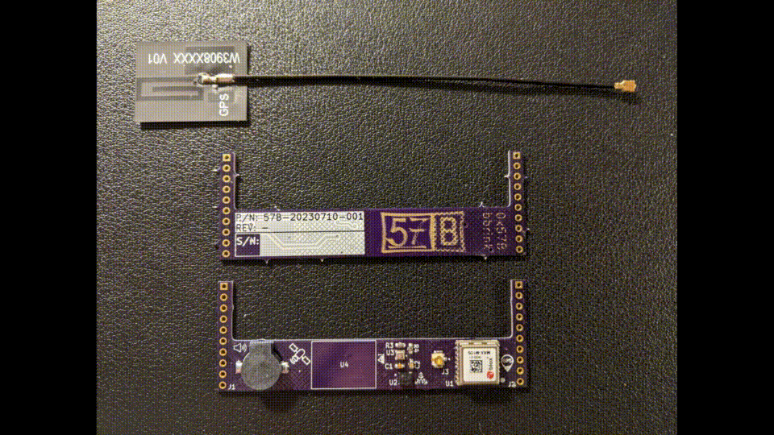
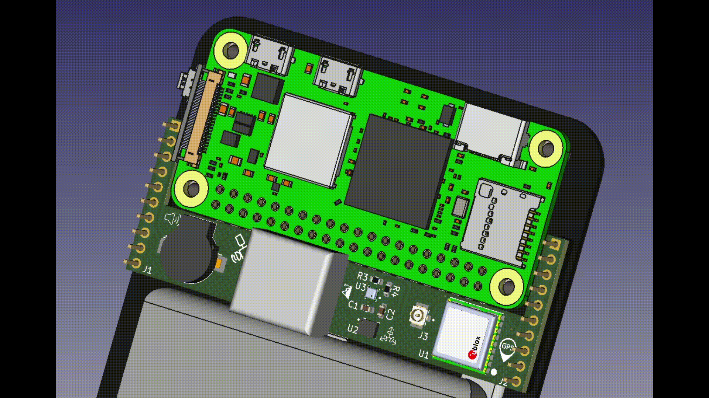

# BeepBerry Sensors Carrier

Integrates UBlox GPS, IMU/MAG, BARO, and buzzer.

REV: - was built and verified on a BeepBerry, however, there are some problems with it:
* During integration, I blew the TPS61030 boost converter IC. I ordered a couple from Mouser and was able to replace it, fixing the device. I was not able to identify what caused the failure in that IC though.
* The buzzer isn't very loud, but can be used as a generic audio device. It's kind of neat that you can use espeak to do text to speech on such a small piezo.
* The GPS antenna doesn't have a large enough ground plane, so 3D fixes break often. It's still usable, just not what you'd expect from a UBlox devkit.
* GPS acquisition eats the battery, but you can control the GPS reset line to disable it to save power. 







## Using the buzzer

### Simple Tones
```
import RPi.GPIO as GPIO
import time
import random

GPIO.setmode(GPIO.BCM)
GPIO.setup(13, GPIO.OUT)

pwm = GPIO.PWM(13, 57)
pwm.start(10)

for i in range(random.randint(0,10)):
  pwm.ChangeFrequency(random.randint(1,10000))
  time.sleep(random.random())
pwm.stop()
```

### ALSA

In `/boot/config.txt`, add:

```
dtoverlay=audremap,enable_jack=on
dtoverlay=pwm-2chan,pin2=13,func2=4
```

then use anything that uses a sound card, IE:

`espeak "SAY SOMETHING"`

`aplay "some.wav"`

## Using GPS PPS

In `/boot/config.txt`, add:

`dtoverlay=pps-gpio,gpiopin=16`

This will allow you to use gpsd with `/dev/pps0`.

